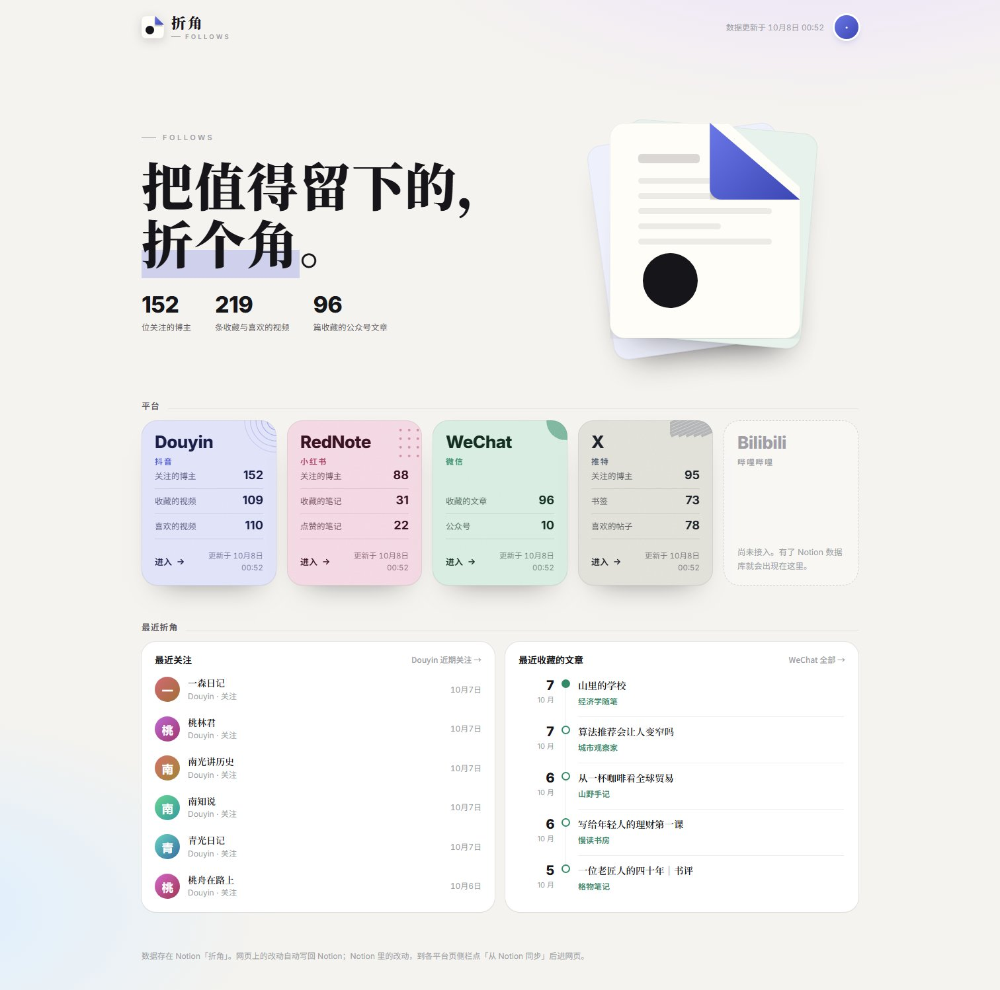
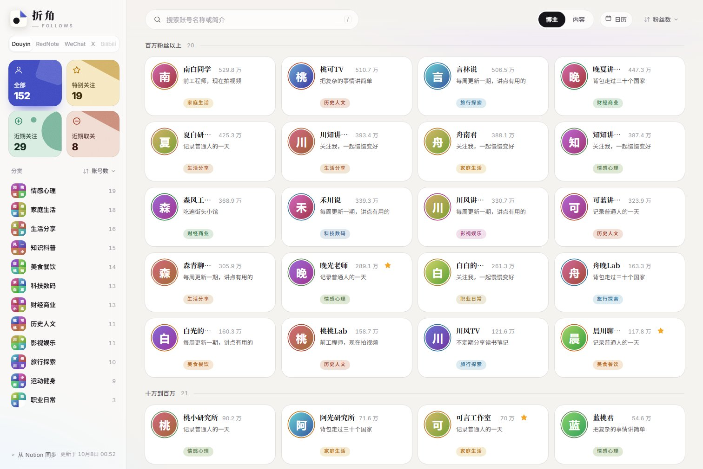
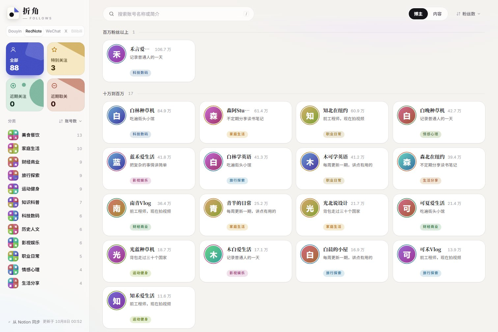
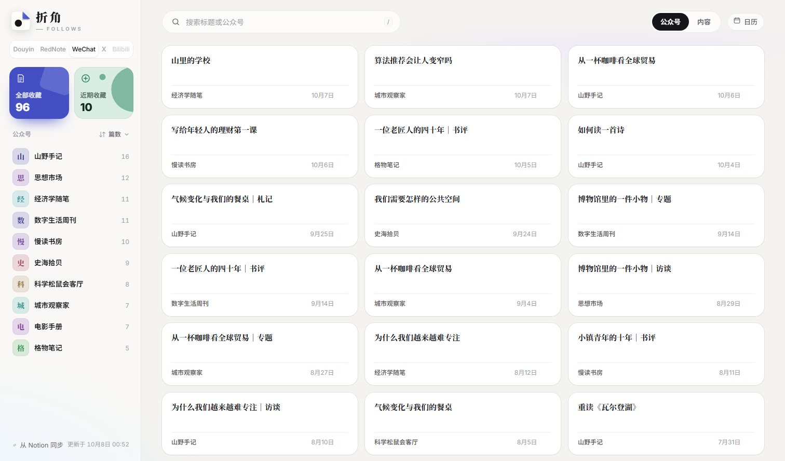
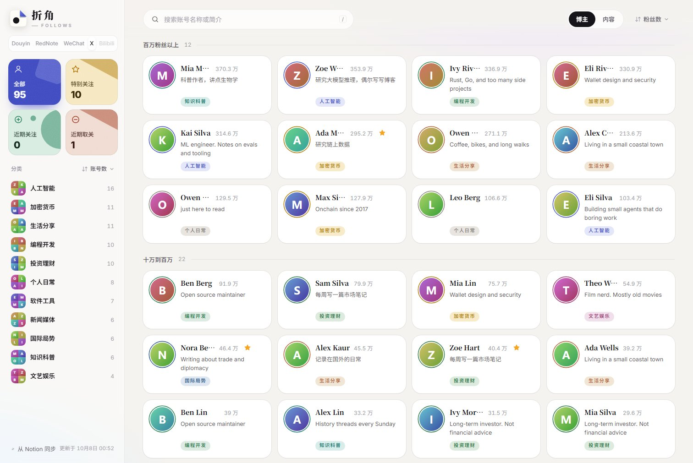
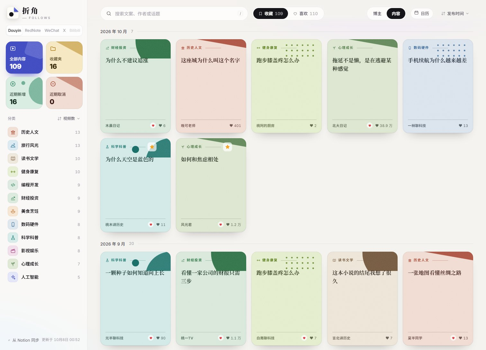
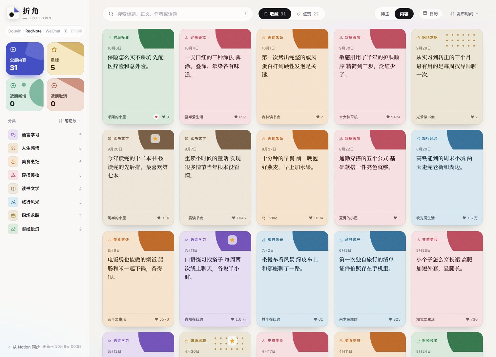
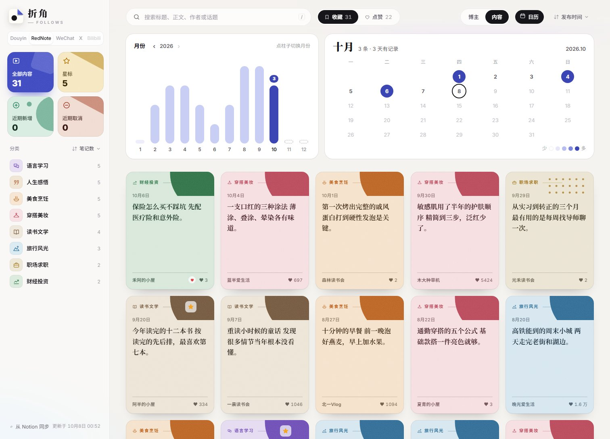
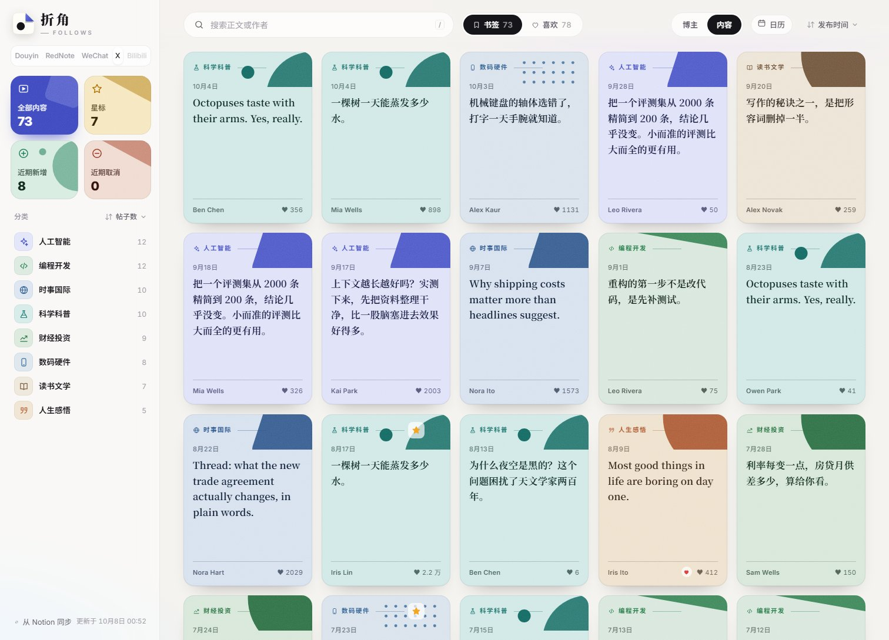
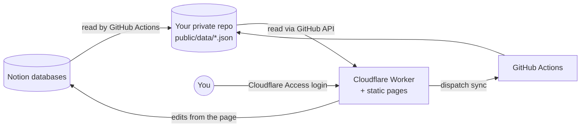

# Zhejiao (折角) FOLLOWS

*Fold a corner on what's worth keeping.*

Zhejiao is a self-hosted dashboard for the accounts you follow and the things you save. Creators you follow on Douyin and the videos you liked or bookmarked there, creators you follow on RedNote (小红书) and the notes you saved or liked, accounts you follow on X and the posts you bookmarked or liked, and WeChat articles you saved all live in your own Notion. A clean web page lets you browse them by platform, category and date, and edit categories, stars, unfollow marks and text; every edit is written back to Notion. Notion is the default, and you can swap in another database; see [Using a different database](#using-a-different-database).

[中文](README.md) · [Changelog](CHANGELOG.md) (in Chinese)



| Douyin | RedNote | WeChat | X |
|---|---|---|---|
|  |  |  |  |
|  |  |  |  |

All data in the screenshots is fictional, generated by `scripts/demo-data.mjs`. The UI is in Chinese.

## Features

- **Home**: counts per platform, recently followed creators, recently saved articles.
- **Douyin creators**: browse by category; sort by follower tier, follow order or name; starred, recently followed, recently unfollowed; drag to reorder categories.
- **Douyin bookmarks and likes**: two independent libraries, browse by category and publish date; folders and stars; mark as removed or restore; edit title and caption.
- **RedNote creators, saved notes and likes**: the same pages as Douyin; content items are notes, and titles and text can be edited on the card.
- **X creators, bookmarks and likes**: the same pages as Douyin, with an optional category set of their own for accounts; post text can be edited on the card.
- **Stars**: saved and liked items on all three platforms can be starred and are gathered under "星标" (Starred) in the sidebar.
- **Calendar**: the "日历" (Calendar) button on every page shows a bar per month and a month calendar; click a day to see only that day.
- **WeChat articles**: an account view grouped by official account and a content view grouped by article category, ordered by save time; edit titles, rename accounts, delete.
- **Two-way sync**: edits on the page go to Notion automatically; edits made in Notion reach the page when you press "Sync from Notion" (one platform at a time).
- **Private by default**: the whole site sits behind Cloudflare Access, and the Worker verifies the Access token again.

## How it works



- Notion is the single source of truth. A GitHub Actions workflow reads it and commits a few JSON files per platform under `public/data/<platform>/`.
- The Worker serves those files straight from the repository with ETag caching, so new data is live as soon as it is committed, with no redeploy. If GitHub is unreachable it falls back to the cached copy, then to the copy bundled at deploy time.
- Edits from the page are written to Notion by the Worker, then batched into a page-level sync that brings only the changed rows back.
- A read-only Notion integration is used by the workflow; the integration with write access is used only by the Worker. On the GitHub side, a GitHub App installed only on your repository is used.

## Using a different database

Zhejiao uses Notion as its database by default. That is the author's own preference, not a requirement.

The web pages only read JSON files under `public/data/<platform>/` and never talk to the database directly. So whether you prefer Airtable, Feishu Bitable (飞书多维表格), Google Sheets or a database you run yourself, the pages work as they are, and only the code in the table below, which talks to the database, needs to change.

| File | What it does | When you switch |
|---|---|---|
| `scripts/sync-*.mjs` | Reads the database and writes the JSON files | Read from your database instead and keep the output format; the short field keys are documented at the top of each script |
| `src/write-api.js` | Writes edits made on the page back to the database | Write to your database instead |
| `src/platforms.mjs` | Maps each platform to its databases | Put your own table identifiers here |
| `tools/resync.py` | Compares a fresh export with the database and writes changes back | Only if you use this tool |

For the fields each table needs, follow [docs/notion-schema.md](docs/notion-schema.md) and create equivalents with the same meaning. A few UI labels mention Notion, such as "从 Notion 同步" (Sync from Notion) in the sidebar; rename them to match your product if you like.

> [!NOTE]
> The products named here are only examples. Out of the box, the code supports Notion only.

## Try it locally (no services needed)

```bash
node scripts/demo-data.mjs
python -m http.server 8080 -d public
```

Open `http://localhost:8080/` for the home page and `http://localhost:8080/app.html` for the platform pages. Requires Node.js 20+.

## Deploy your own

1. Click **Use this template** on GitHub and create your own **private** repository. Your data files will be committed there, so keep it private.
2. Follow [docs/setup.md](docs/setup.md) (in Chinese) to set up the Notion databases and two integrations, a GitHub App, the Cloudflare Worker and Access, then fill in `wrangler.jsonc` and `src/platforms.mjs`.
3. Open your site and press "从 Notion 同步" (Sync from Notion) once on each platform.

The required Notion columns are listed in [docs/notion-schema.md](docs/notion-schema.md).

## Tools

`tools/` contains helpers to export **your own** Douyin and X following lists, likes and bookmarks, and to write later changes back to Notion. Please read the disclaimer in [tools/README.md](tools/README.md) before using them. They rely on undocumented web endpoints, which may change at any time, and heavy use may trigger rate limits.

## License

Code and the Zhejiao logo are released under the [MIT License](LICENSE). This project is not affiliated with Douyin, ByteDance, RedNote, X, Tencent or Notion.
