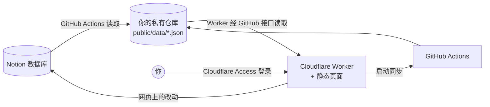

# 折角 FOLLOWS

把值得留下的，折个角。

折角是一个自己部署的「关注与收藏」整理页。抖音上关注的博主、收藏和喜欢的视频，X 上关注的账号、书签和喜欢的帖子，微信里收藏的公众号文章，都放进你自己的 Notion，再在一个干净的网页上按平台、分类浏览，随手改分类、标星、标记取关、改标题，改动写回 Notion。数据库也可以换成你习惯的其他产品，见[换用别的数据库](#换用别的数据库)。

[English](README.en.md)


| 抖音 | X | 微信 |
|---|---|---|
|  |  |  |
|  |  | |

截图里的数据都是 `scripts/demo-data.mjs` 生成的虚构内容。

## 能做什么

- **首页**：各平台的数量、最近关注的博主、最近收藏的文章。
- **抖音博主**：按分类浏览，按粉丝数分档、按关注先后或名称排序；特别关注、近期关注、近期取关；拖动调整分类顺序。
- **抖音收藏与喜欢**：两个库各自独立，按分类与发布时间浏览；收藏夹与星标；标记取消与恢复。
- **X 博主、书签与喜欢**：和抖音同一套页面，账号可以用单独的一套分类；书签、喜欢两个库各自独立，没有收藏夹与星标。
- **微信公众号文章**：侧栏按公众号分类，按收藏时间排列；网页上改标题、改公众号名（单篇或整个号）、删除。
- **两个方向的同步**：网页上的改动自动写回 Notion；Notion 里的改动在网页侧栏点「从 Notion 同步」后进网页，只同步当前平台。
- **只有你能看**：整站放在 Cloudflare Access 后面，Worker 再核验一次登录凭证。

## 怎么运作



- Notion 是唯一的数据源。同步任务（`.github/workflows/sync-follows.yml`）读 Notion，把每个平台写成 `public/data/<平台>/` 下的几个 JSON 文件并提交。
- Worker 带着 ETag 从仓库读这些文件返回给网页，数据提交即生效，不需要重新部署；GitHub 读不到时依次退回缓存与部署时打包的那份。
- 网页上的改动由 Worker 写进 Notion，再合并成一次「按页面同步」，只把改了的几行带回数据文件。
- 只读的 Notion 连接给同步任务用，有写入权限的连接只给 Worker 用；GitHub 侧用一个只装在你仓库上的 GitHub App。

## 换用别的数据库

折角默认用 Notion 作数据库，这是作者的个人偏好，并不是必须的。

网页只读取 `public/data/<平台>/` 下的 JSON 文件，从不直接访问数据库。所以换成 Airtable、飞书多维表格、Google 表格或者自建的数据库，网页的功能都不用改，只需要改下表这几处和数据库打交道的代码。

| 文件 | 作用 | 换数据库时 |
|---|---|---|
| `scripts/sync-*.mjs` | 从数据库读出数据，生成 JSON 文件 | 改成读你的数据库，输出格式不变；字段的短键名见各脚本开头的注释 |
| `src/write-api.js` | 把网页上的改动写回数据库 | 改成写你的数据库 |
| `src/platforms.mjs` | 记录每个平台对应哪些库 | 换成你的库的标识 |
| `tools/resync.py` | 重新导出名单后比对并写回 | 用到这个工具才需要改 |

建库时可以参照 [docs/notion-schema.md](docs/notion-schema.md) 里的字段，按相同的含义建。界面上「从 Notion 同步」等几处文字，也可以顺手换成你用的产品名。

> [!NOTE]
> 上面提到的产品只是举例，代码目前只支持 Notion。

## 快速看一眼（不配任何服务）

```bash
node scripts/demo-data.mjs
python -m http.server 8080 -d public
```

打开 `http://localhost:8080/` 是首页，平台页从 `http://localhost:8080/app.html` 进。需要 Node.js 20 以上。

## 部署成自己的

1. 在 GitHub 上点「Use this template」，用这个仓库生成你自己的**私有**仓库。数据文件会提交进那个仓库，所以一定要设成私有。
2. 按 [docs/setup.md](docs/setup.md) 准备 Notion 数据库与两个连接、GitHub App、Cloudflare Worker 与 Access，填好 `wrangler.jsonc` 与 `src/platforms.mjs`。
3. 部署后打开网站，在每个平台的侧栏点一次「从 Notion 同步」。

Notion 各库需要哪些列见 [docs/notion-schema.md](docs/notion-schema.md)。

### 拿到这个仓库后来的更新

用模板生成的仓库不会自动跟着更新。需要时：

```bash
git remote add upstream https://github.com/<本仓库>.git
git fetch upstream
git merge upstream/main --allow-unrelated-histories   # 只有第一次需要这个参数
```

可能冲突的只有你填过配置的 `wrangler.jsonc` 与 `src/platforms.mjs`，保留自己那份即可。

## 目录

| 路径 | 内容 |
|---|---|
| `public/index.html` | 首页 |
| `public/app.html` | 各平台的页面（单文件，原生 JavaScript） |
| `src/worker.js` | Worker 入口：路由、合并同步请求的 Durable Object |
| `src/data-api.js` | 读数据文件、查同步进度 |
| `src/write-api.js` | 网页上的写入，写进 Notion |
| `src/github-app.js` | GitHub App 安装令牌 |
| `src/platforms.mjs` | 平台与 Notion 数据库的对应 |
| `scripts/sync-*.mjs` | 同步任务：Notion 到数据文件 |
| `scripts/summary.mjs` | 首页用的摘要 |
| `scripts/demo-data.mjs` | 生成演示数据 |
| `tools/` | 导出抖音关注、喜欢、收藏与写回 Notion 的辅助工具，先读 [tools/README.md](tools/README.md) |

## 许可

代码与「折角」标志都按 [MIT 许可证](LICENSE) 开放。

工具目录里的脚本仅供导出**你自己账号**的数据，使用前请阅读 [tools/README.md](tools/README.md) 的免责说明。
